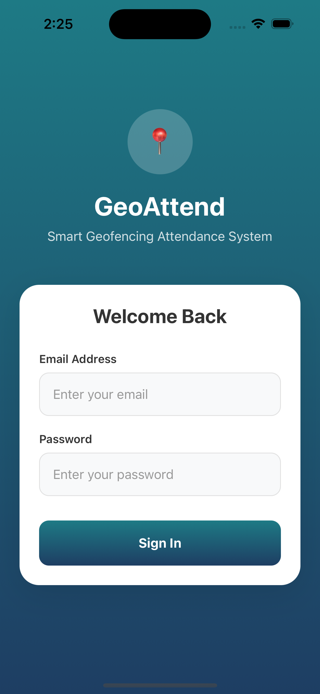
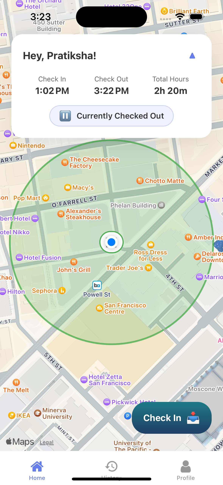
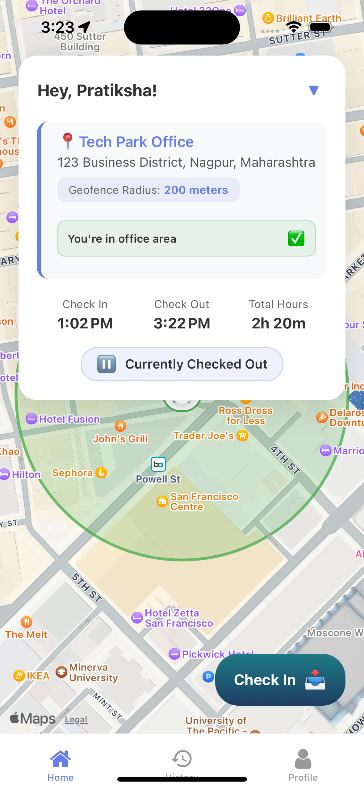
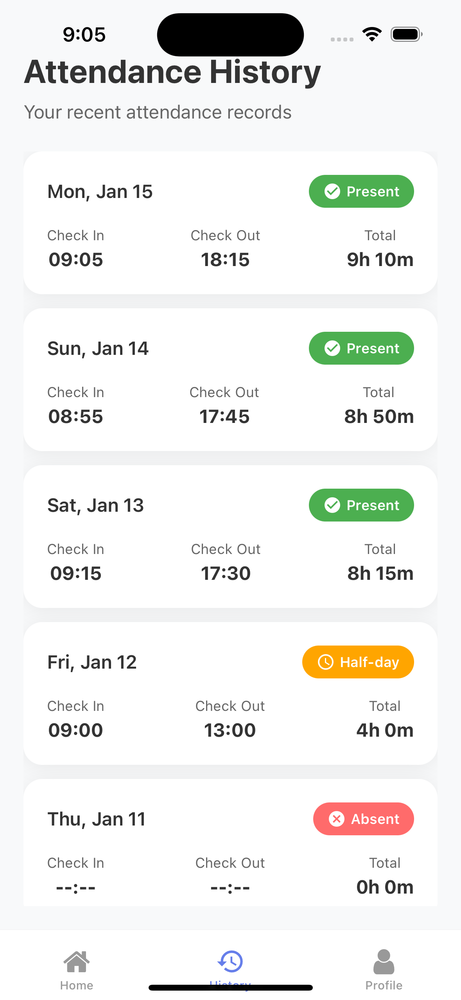

# GeoAttend - Smart Attendance System

A modern geofencing-based attendance tracking system built with React Native (Expo) and Node.js. Employees can check in/out only when within the office geofence, ensuring accurate location-based attendance.

  
  
  
  
  

## 🚀 Features

- **📍 Geofencing Technology** - Check in/out only within office radius
- **📱 Cross-Platform Mobile App** - Built with React Native & Expo
- **🔐 JWT Authentication** - Secure user authentication
- **📊 Real-time Analytics** - Attendance history and statistics
- **🏢 Multi-Office Support** - Configurable office locations
- **👥 Role-based Access** - Separate interfaces for employees and admins

## 🛠️ Tech Stack

### Frontend
- React Native with Expo
- TypeScript
- React Navigation
- React Native Maps
- Linear Gradients

### Backend
- Node.js with Express
- TypeScript
- MongoDB with Mongoose
- JWT Authentication
- bcryptjs for security

